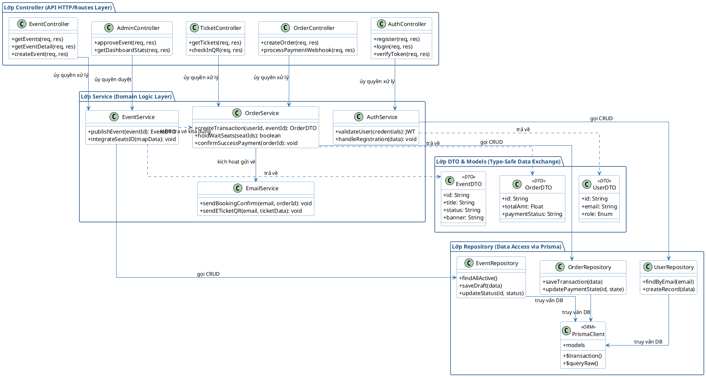

# 🧩 Sơ đồ Lớp (Class Diagram) - Kiến trúc Backend Phân Lớp

Đây là Sơ đồ Lớp cập nhật mới nhất, phản ánh chính xác **kiến trúc Backend phân lớp (Layered Architecture)** của dự án JoyB Platform. Bao gồm luồng gọi xử lý từ HTTP Request đi qua Controller, xuống Service xử lý nghiệp vụ, giao tiếp cơ sở dữ liệu qua Repository (Prisma) và gửi trả DTO.

### 💡 Diễn giải cấu trúc

* **Luồng đi (Flow)**: Dữ liệu chảy từ trên `Controller` (nhận Http) → Gọi xuống `Service` (chạy logic chức năng, giữ chỗ, thanh toán) → Xuống `Repository` để lưu vào CSDL qua `Prisma ORM`.
* **Giấu dữ liệu nhạy cảm**: Tại Service, trước khi đẩy data ngược lên Controller để Response cho Client, lớp Service sẽ map với `Lớp DTO` (Data Transfer Objects). Ví dụ trả ra `UserDTO` sẽ không bao giờ có chứa `password_hash`.
* **Mối quan hệ phân lớp**: Đảm bảo Single Responsibility Principle. Controller không gọi thẳng Prisma, mà bắt buộc phải qua Service để validate nghiệp vụ. Mọi giao tiếp với tầng CSDL phụ thuộc vào PrismaClient.
