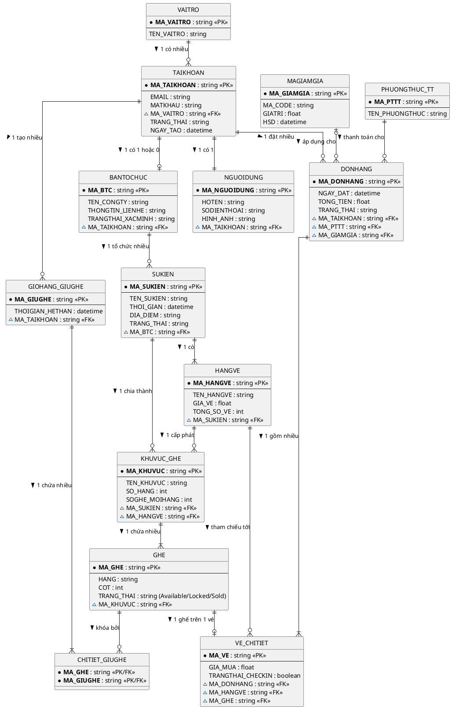

# 🗄️ Mô Hình Dữ Liệu ERD - Dự án JoyB Platform

Dựa vào sơ đồ database mẫu, đây là **Mô Hình Dữ Liệu ERD (Entity Relationship Diagram)** được viết lại hoàn toàn bằng mã **PlantUML**. Mã này sẽ render ra các hộp Entity chia vạch rõ ràng giữa Primary Keys, Foreign Keys và các trường dữ liệu phụ giống hệt với nét vẽ của phần mềm database chuyên nghiệp!

### 💡 Ghi chú ký hiệu:
* Ký hiệu `*`: Thể hiện trường bắt buộc (Not Null).
* Ký hiệu `<<PK>>`: Primary Key (Khóa chính).
* Ký hiệu `<<FK>>`: Foreign Key (Khóa ngoại). `~` chỉ tính chất Protected/Internal trong biểu diễn lớp, thường dùng ám chỉ field tham chiếu.
* Nửa trên của hộp chứa Khóa chính, nửa dưới ngăn cách bằng rạch ngang `--` chứa các data phụ.
* Layout lưới trực giao (`linetype ortho`) giúp các đường mũi tên liên kết vuông vắn nhất.
