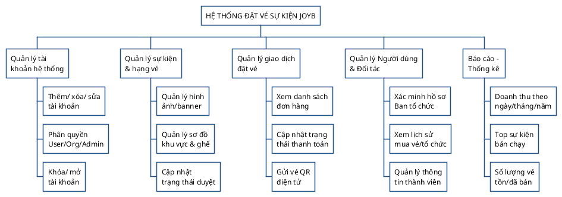

# 🏗️ Sơ đồ Phân rã Chức năng (Functional Decomposition)

Dựa vào sơ đồ phân rã theo dạng cây (WBS) mẫu của bạn lấy từ website bán quần áo, dưới đây là mã PlantUML (**chuẩn "nano banana"** 🍌😎) vẽ sơ đồ phân rã chức năng tương tự, nhưng được thiết kế riêng biệt cho nền tảng bán vé sự kiện JoyB!

Bạn có thể copy dán vào VSCode (với extension PlantUML) hoặc Web PlantUML Viewer để render ra ảnh hộp khối cây (Tree Box) tương tự.

### 💡 Ghi chú: 
* Sơ đồ sử dụng cú pháp `@startwbs` (Work Breakdown Structure) được thiết kế chuyên dụng trong PlantUML cho việc vẽ biểu đồ phân rã chức năng, các node sẽ tự động tạo thành hình khối kết nối với nhau như ảnh gốc.
* Tôi thêm `\n` vào một số text để ngắt dòng cho hộp node khi xuất ra không bị chiều dài quá dài, giống hệt với các hộp chữ nhật gọn gàng trong hình mẫu!
