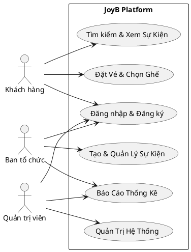
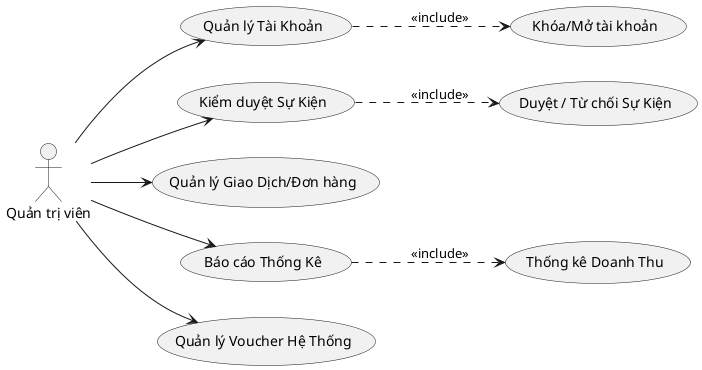
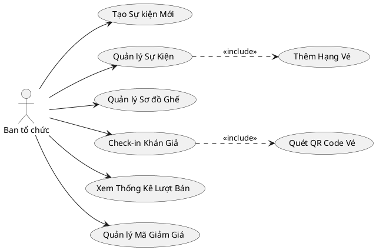
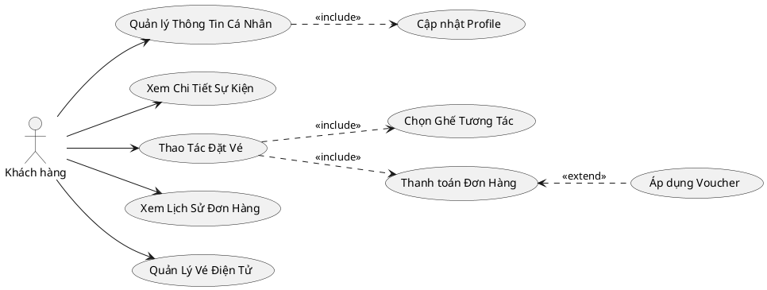

# ✨ Sơ đồ Use Case hệ thống JoyB Platform 

Dưới đây là phiên bản **Sơ đồ Use Case** được viết bằng mã **PlantUML** chuẩn, hỗ trợ vẽ chính xác vòng elip (oval) Use case cùng nét đứt `<<include>>`, `<<extend>>` tương tự như Astah/phần mềm mà bạn chụp.

Bạn có thể render đoạn mã `plantuml` này thông qua các plugin trên VSCode hoặc dán vào trình dịch PlantUML Online để xem biểu đồ siêu chuẩn!

---

### 1. Sơ đồ Use Case Tổng Quát Hệ Thống

---

### 2. Sơ đồ Use Case Phân rã Quản trị viên (Admin)

---

### 3. Sơ đồ Use Case Phân rã Ban tổ chức (Organizer)

---

### 4. Sơ đồ Use Case Phân rã Khách hàng (Customer)

